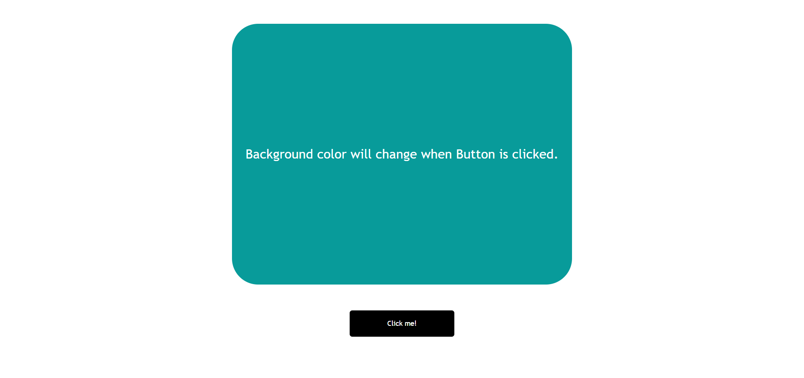

# JavaScript Project - Random BackGround Color Changer

## **Project: Color Changer**

### Concepts learned from this project:
- Learned About Generating random RGB colors on each button click.

**Live Link :** [Deployed Link](https://js-project-colorchanger.netlify.app/)
>### Preview :

